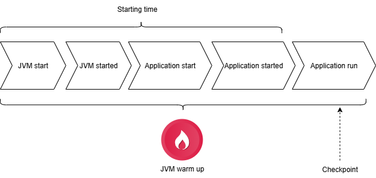

<!-- _class: title -->

# Spring Boot gibt Gas II

## Coordinated Restore at Checkpoint (CRaC)

---

# Motivation

Coordinated Restore at Checkpoint (CRaC) saves an optimized (warmed-up) state of a running JVM/application and
reuses it for the next start. This is particularly useful for applications that need to be restarted frequently.

Use Cases:

1. Microservices architectures where quick startup times are crucial.
2. Services with frequent restarts

# Java

CRaC is a feature of the Java Virtual Machine (JVM) and based on Linux feature [CRIU](https://criu.org/Main_Page)
(Checkpoint/Restore in Userspace). Thus, a linux system is required. Also a JDK which supports CRaC.

## Prerequisites

- Linux system
- JDK with CRaC support (e.g. Azul Zulu with CRaC)
- (for Spring Boot) the library `org.crac:crac` in the classpath

# Spring Boot

Since Spring Boot 3.2 CRaC is supported but experimental. It uses the crac.org library to implement the necessary
prerequisites for CRaC. Projects of the Spring ecosystem give information about the correct handling of project-specific
requirements to make it compatible with CRaC.

# How to use CRaC

Important notes:

- Closed handles (e.g. no open files, sockets, etc.) - see CRaC documentation for details: https://github.com/CRaC
- No credentials inside the application (e.g. no passwords, tokens, etc.)

# Picture

# Advantages

- Reduced startup time

# Disadvantages

- Implementation of closed resources necessary.
- Special handling of credentials.
- Every application update requires a new checkpoint.
- Needs a Linux system because of CRIU.
- Needs a JDK with CRaC support

# Benchmarks

| **Startup Time** | Java          | SB-Maven-Plugin | CDS           | AOT-Cache     | 
|------------------|---------------|-----------------|---------------|---------------|
| Demo Project     | 1.935 seconds | 1.503 seconds   | 0.095 seconds | 0.050 seconds |    
| Pet-Clinic       | 10.7 seconds  | 6.0 seconds     | 0.118 seconds | -             

# Helpful Articles/Talks

- JDK with CRaC support: https://www.azul.com/products/components/crac/
- Spring blog
  article: https://spring.io/blog/2023/10/16/runtime-efficiency-with-spring#jvm-checkpoint-restore-scale-to-zero-with-spring-and-project-crac
- Demo-Project with simple setup: https://github.com/sdeleuze/spring-boot-crac-demo
- Another article with PetClinic
  example: https://bell-sw.com/blog/how-to-use-crac-with-spring-boot-apps-in-a-docker-container/

# Further Topics

https://openjdk.org/projects/leyden/

