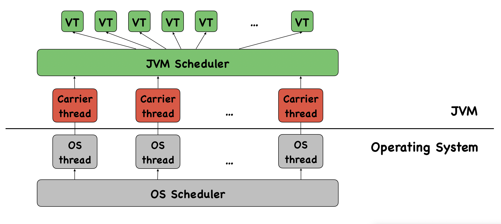

<!-- _class: title -->

# Spring Boot gibt Gas

## Virtual Threads

---

# Motivation

- Traditional model: One thread per request → simple but resource-heavy
- Limitation of platform threads: high memory & CPU cost, expensive to create
- Scalability follows Little’s Law: throughput = concurrency / latency
- Reactive Programming: scales well but is harder to read, debug, and profile
- Virtual threads: Lightweight, efficient, massively scalable

--- 
<!-- _class: timeline -->

# Timeline: Java / Spring Boot

Project Loom: introduce a lightweight concurrency construct to Java

- September 2022
JEP 425: Preview Feature in JDK 19
- October 2022
Experimental support in Spring Boot
- September 2023
JEP 446: Virtual Threads are finalized in JDK 21
- November 2023
Full support in Spring Boot 3.2.0

--- 

# Architecture

--- 

# Advantages

- Ideal for I/O-bound workloads: ideal for high-throughput, I/O-heavy workloads
- Lightweight & Scalable: millions of threads with minimal memory overhead
- Simplified Concurrency Model: maintains the familiar thread-per-request model
- Better Debugging & Profiling: works with JFR, JStack, and existing tools.
- Compatibility: works with existing java.lang.ThreadAPI
- Improved Context Propagation: Scoped Values replace ThreadLocal

---

# Disadvantages

- Not for CPU-bound Tasks: no speedup for compute-heavy workloads
- Scheduler Overhead: JVM mapping adds some cost 
- Synchronization Challenges: lock contention can hurt performance
- Not a Replacement for Reactive Programming
- Requires JDK 21+ / Spring Boot 3.2.0+
---

# Examples and Benchmark

Show code ...

---

# Comparison

|                        | Platform Threads       | Virtual Threads |
|--------------------------------|--------------------------------------|--------------------------------|
| **Implementation**      | Managed by the OS     | Managed by the JVM (userland) |
| **Pooling**                    | Threads should be pooled             | No pooling, new thread per task |
| **Lifetime**                   | Long-lived, reused                   | Short-lived, created per task |
| **Usage**                      | Multiple tasks per thread            | One task per virtual thread |
| **Thread Cost**                | Heavyweight (more RAM, CPU ...) | Lightweight (very low overhead) |
| **Blocking I/O**               | Blocks the OS thread                 | Parks the virtual thread |
| **Scalability**                | Limited by OS resources       | Millions of concurrent threads |