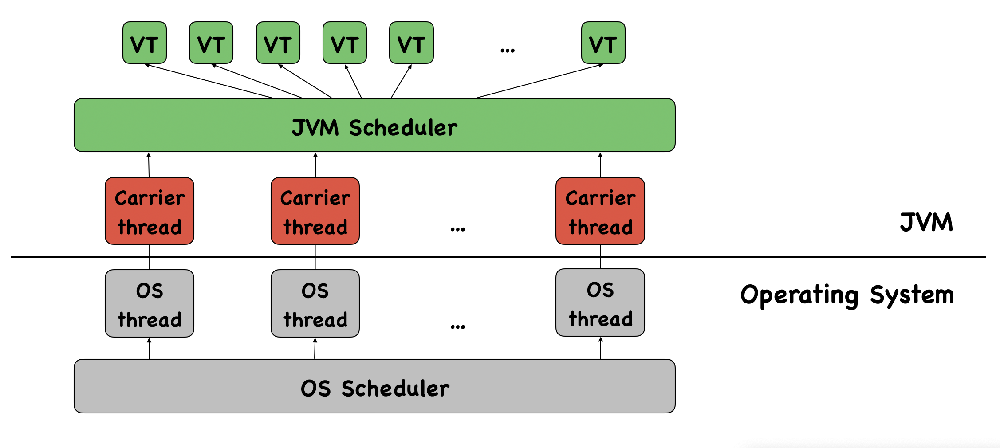

<!-- _class: title -->

# Spring Boot gibt Gas

## Virtual Threads

---

# Motivation

- Traditional model: One thread per request → simple but resource-heavy
- Limitation of platform threads: high memory & CPU cost, expensive to create
- Scalability follows Little’s Law: throughput = concurrency / latency
- Reactive Programming: scales well but is harder to read, debug, and profile
- Virtual threads: Lightweight, efficient, massively scalable

--- 

# Java

- Project Loom: introduce a lightweight concurrency construct to Java
- September '22: Virtual threads introduced as a preview feature (JDK 19, JEP 425)
- September '23: Virtual threads became stable (JDK 21, JEP 444)
- Scoped Values (JEP 446): efficient alternative to ThreadLocal for passing contextual data across threads

---

# Spring Boot

- October '22: experimental support for virtual threads
- November '23: full support for virtual threads with release 3.2.0
- Easy to use by enabling the flag spring.threads.virtual.enabled
  - Tomcat and Jetty use virtual threads for request handling

---

# Architecture

--- 

# Advantages

- Lightweight & Scalable: millions of threads with minimal memory overhead
- Simplified Concurrency Model: maintains the familiar thread-per-request model
- Better Debugging & Profiling: works with JFR, JStack, and existing tools.
- Compatibility: works with existing java.lang.Thread APIs
- Ideal for I/O-bound workloads: ideal for high-throughput, I/O-heavy workloads
- Improved Context Propagation: Scoped Values replace ThreadLocal

---

# Disadvantages

- Not for CPU-bound Tasks: no speedup for compute-heavy workloads
- Scheduler Overhead: JVM mapping adds some cost 
- Synchronization Challenges: lock contention can hurt performance
- Not a Replacement for Reactive Programming
- Requires JDK 21+ / Spring Boot 3.2.0+

---

# Live Coding

- Show usage of virtual threads
- Perform Benchmark with Spring Boot and a REST controller

---

# Comparison

|                        | Platform Threads       | Virtual Threads |
|--------------------------------|--------------------------------------|--------------------------------|
| **Implementation**      | Managed by the OS     | Managed by the JVM (userland) |
| **Pooling**                    | Threads should be pooled             | No pooling, new thread per task |
| **Lifetime**                   | Long-lived, reused                   | Short-lived, created per task |
| **Usage**                      | Multiple tasks per thread            | One task per virtual thread |
| **Thread Cost**                | Heavyweight (more RAM, CPU ...) | Lightweight (very low overhead) |
| **Blocking I/O**               | Blocks the OS thread                 | Parks the virtual thread |
| **Scalability**                | Limited by OS resources       | Millions of concurrent threads |
| **Context**                    | Thread Local                         | Scoped Values |
